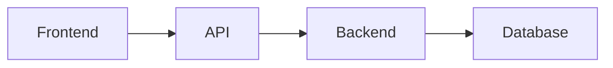

# Backend Tutorial
A non-specific backend for the purpose of education on backend development.

## What is a backend?
Web applications have a *frontend* and a *backend*. The frontend is what the user interacts with directly. These
are things like web pages that may contain buttons and text fields. Web applications usually retrieve some kind of
data to display from a database like user account information. This is the backend, which communicates with the 
frontend via an *application programming interface* (API), which dictates the format requests for data are to be 
sent and how received. 

This repo will show basic code examples of a backend with as few libraries or frameworks as possible. We will implement:
<ul>
  <li>API</li>
  <li>Database</li>
  <li>Authentication</li>
</ul>

### TODO
Authentication